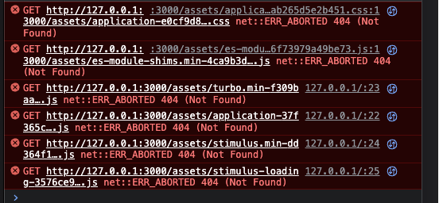

# How projects are created
## rails new rails5

# Start production with Rubymine
# or start Command line:
` / bin/ZSH - c "bash - c 'env RBENV_VERSION = 3.2.2 / opt/homebrew/Cellar/rbenv / 1.2.0 / libexec/rbenv exec ruby - x / Users/ok/RubymineProjects tempt1 / bin/bundle exec ruby/Users/ok/RubymineProjects tempt1 0.0.0.0 / bin/rails server - b - p 3000 -e production'"
`
* This is a display in production environment startup, access address is http://0.0.0.0:3000 (normal) and http://127.0.0.1:3000(all JS is 404 status)
## *NOTE*
 `rails assets:precompile RAILS_ENV=production` is excuted

